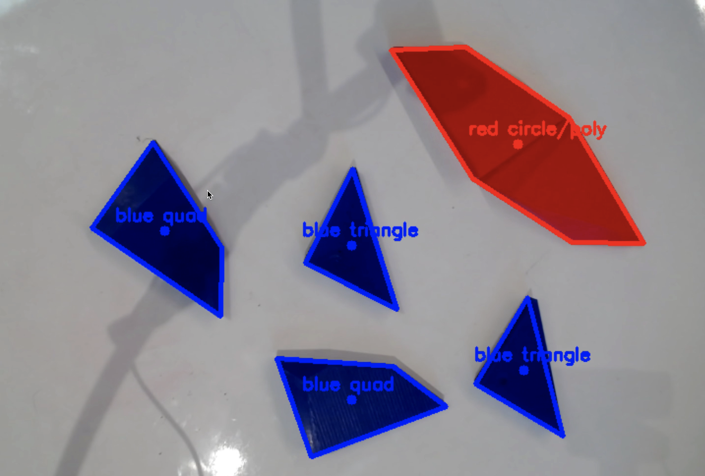

# DAVE — Design Agent for Visual Exploration

> A live, physical-to-digital design tool that bridges 3D printed massing models with AI-driven parametric generation in Rhino/Grasshopper.



Built at AECTech.

---

## How it works

Place physical massing blocks on a blank background. A camera detects their outlines via OpenCV and streams them into Rhino as live 2D polygons. Claude, connected via MCP, can then interface with the geometry and be your personal design assistant!

| Layer           | Component                                                       |
| --------------- | --------------------------------------------------------------- |
| Computer Vision | `detect_shape_edges.py` — detects colored blocks via webcam     |
| TCP Stream      | `tcp_sender.py` — streams detections to Rhino over localhost    |
| Rhino           | `rhino_receiver.py` — receives shapes, draws outlines live      |
| Grasshopper     | `Components.gh` — parametric tools the AI agent can call        |
| AI Agent        | Claude via MCP (Swiftlet), calls GH tools from natural language |

### Prerequisites

- Python 3.11+
- Rhino 8 with Grasshopper
- [Swiftlet](https://www.food4rhino.com/en/app/swiftlet) MCP plugin for Rhino
- Claude desktop app
- Webcam

### Install

```bash
git clone https://github.com/your-org/dave
cd dave
pip install -r requirements.txt
```

### Run

1. **Open Rhino** and open `Components.gh` in Grasshopper.
2. **Attach the receiver** — run `rhino_receiver.py` inside Rhino via _Tools > PythonScript > Run_.
3. **Configure Claude** — add the Swiftlet MCP server to your Claude config file if not already done:
   ```json
   {
     "mcpServers": {
       "swiftlet": {
         "command": "path/to/swiftlet-mcp"
       }
     }
   }
   ```
4. **Open Claude** desktop app.
5. **Run the TCP sender** — in a terminal:
   ```bash
   python tcp_sender.py
   ```
   Point your webcam at the mat and move blocks around. Press `q` to quit, `s` to snapshot.

---

## License

MIT
